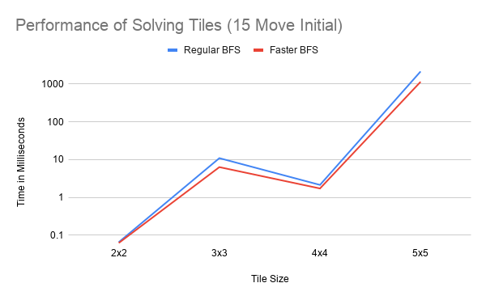
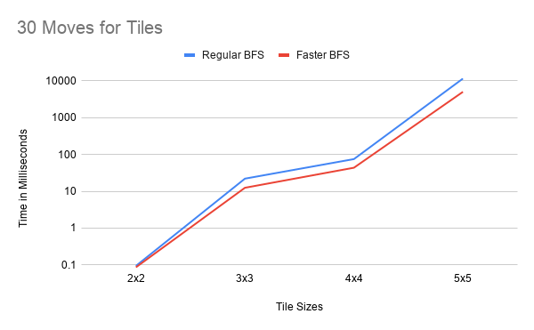
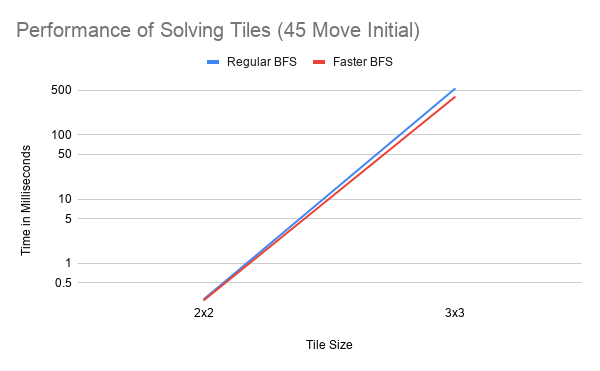
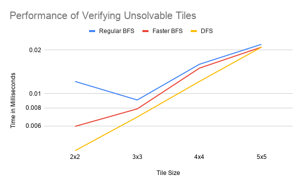
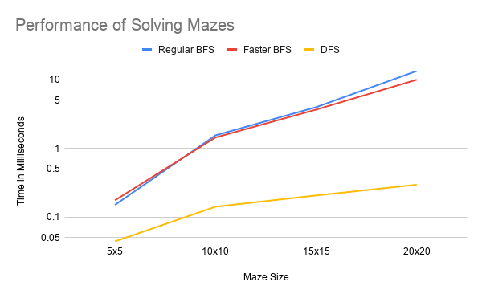
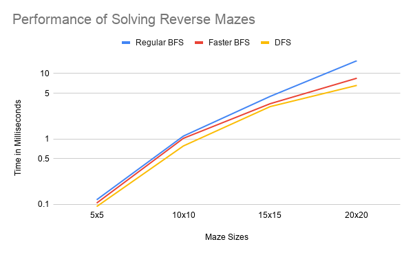
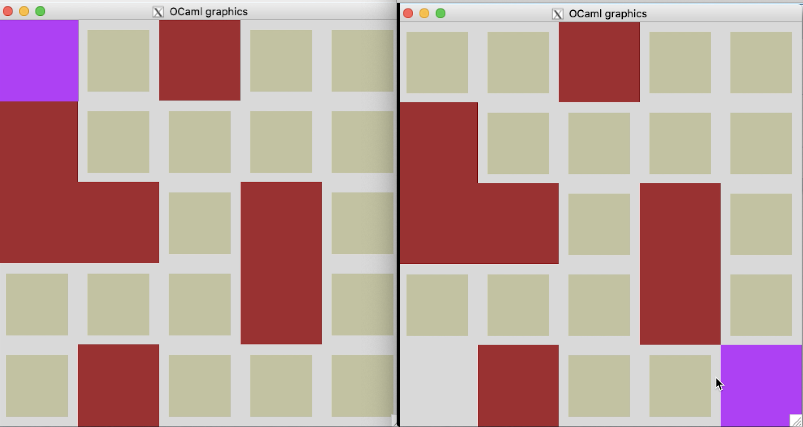
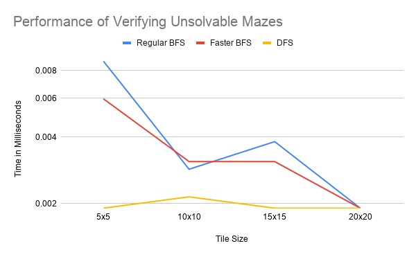

## 
The Search for Intelligent Solutions :camel:: Discussion of Experimental Results

<i>Sylvia Cruz-Albrecht Jacinta Olonilua</i> 
 
For this pset we conducted experiments that tested the efficiency of various search implementations in solving tile and maze games.

### Experimental Design

Our design is functor-based, such that experiments.ml and tests.ml contain solely a set of unique modules that are passed into functors in order to acquire a testing function. There are four main functors (and their associated functions), abstracted and separated into a tests_functions file, to aid in experimenting on both solvable and unsolvable versions of tiles and mazes. This system design allows for dynamic testing and performance monitoring of various versions of puzzles while minimizing code duplication.

### Breadth-First Search vs. Depth-First Search

The various search regimens of Regular Breadth-First Search (BFS), Faster Breadth-First Search (BFS), and Depth-First Search (DFS) are a result of the varying implementation of the collections that store pending states to be visited by the search algorithm. While Regular BFS and Faster BFS both use a collection that acts as a queue, DFS uses a collection that acts as a stack. This difference between first-in-first-out (FIFO) and last-in-first-out (LIFO) behavior in queues and stacks, respectively, leads to a different solve mechanism. For queues, pending states are searched in a “breadth-first” manner, in which the neighboring states of the current state are first searched before proceeding to the neighbors of those neighbors. In stacks, the search operates “depth-first,” such that a single pathway is traversed all the way until the end before backtracking to another neighbor of the current state. We hypothesize that BFS will outperform DFS in tile puzzles where the data structure is extremely deep and solutions are rare, while DFS will excel in maze puzzles due to the more direct traversal of states. However, the only way to know for sure is to experiment.

### Time Complexity of BFS Implementations

There is an additional level of variance between Regular BFS and the Faster BFS due to their underlying implementation as either a list or two stacks.

For Regular BFS (MakeQueueList), adding an element to the queue uses the “@” operator, which has a runtime of O(n) since the time complexity grows linearly as the size of the existing queue grows. Its best and worst case for adding an element is O(n). Meanwhile, the take function for Regular BFS is O(1) since it simply returns the head and tail of the queue.

In the MakeQueueStack functor used to implement Faster BFS, elements are consed onto the front of the second stack of the queue. This means that the add function has a constant runtime, O(1), that isn't dependent on the size of the queue. The take function’s worst case will be O(n) due to the need to reverse the list, but this is only when the first stack is empty. If the first stack contains elements then its complexity will be constant, O(1). Thus, in general we can expect that the BFS using MakeQueueStack will be more efficient than that of MakeQueueList due to the its lower average time complexity. These differences will likely grow more significant with the size and complexity of the puzzles.

### Results
    Results: Solvable Tile Puzzles
For our first set of experiments, we compared regular BFS and faster BFS on a set of 4 tile puzzles (sizes 2x2, 3x3, 4x4, and 5x5). We did not experiment on DFS for tiles due to time considerations addressed later.\* Of this set of puzzles, we ran three rounds of puzzles, each time passing in a different number of steps from the goal state -- 15, 30, or 45 moves. We have provided charts and graphs of our results. (Note that all graphs measure time on a logarithmic scale.)

*Performance of Solving Tiles (15 Move Initial)*

| Tile Size | Regular BFS | Faster DFS |
|:----------|:------------|:-----------|
| 2x2       | 0.065088    | 0.061989   |
| 3x3       | 10.951996   | 6.337881   |
| 4x4       | 2.140999    | 1.724005   |
| 5x5       | 2165.509939 | 1152.60005 |

  

*Performance of Solving Tiles (30 Move Initial)*

| Tile Size | Regular BFS | Faster BFS  |
|:----------|:------------|:------------|
| 2x2       | 0.093937    | 0.086069    |
| 3x3       | 22.075891   | 12.471199   |
| 4x4       | 75.02985    | 43.710947   |
| 5x5       | 11556.88405 | 5039.286137 |

  

*Performance of Solving Tiles (45 Move Initial)*

| Tile Size | Regular BFS | Faster BFS |
|:----------|:------------|:-----------|
| 2x2       | 0.274897    | 0.265121   |
| 3x3       | 532.227039  | 396.180153 |

  

We found that across the board, the faster BFS consistently outpaced the regular BFS, with a difference that became especially pronounced in the 4x4 and 5x5 puzzles. Additionally, this performance disparity also increases as the number of steps from the goal state are increased. For example, in the 15-move 5x5 tile puzzle, the regular BFS is 1.87 times slower than the faster BFS. In the 30-move 5x5 tile puzzle, the regular BFS rises to 2.29 times slower. This difference in performance likely stems from the different search mechanisms of stacks vs queues. Due to the lower average time complexity of a queue with two stacks, the search algorithm implemented this way enables small efficiency gains with every step -- adding and taking elements from the pending collection -- that ultimately add up to a significant performance difference. Despite the gap between the performance of the two, the graphs reveal that the curves for both types of BFS follow a similar progression for all types of tile puzzles, which can be attributed to the queue behavior that they both exhibit.

Curiously, for the puzzle initialized with 15 moves, the runtime dipped slightly for the 4x4 tile for both Regular and Faster BFS, making it marginally faster than the 3x3 tile. Since the runtimes vary between 1 and 10 ms, this decrease may not be statistically significant, and given a larger sample size, we can still expect a clear pattern of increased runtime as puzzle size increases. This finding may also suggest that for puzzles initiated only a few moves away from the goal state, the correlations between time and size of puzzle may deteriorate slightly.

It is interesting to note the differences in runtime that result from changing the tile’s number of steps from the initial position. As the number of steps increases from 15 to 30 and from 30 to 45, there is a general pattern of increased runtime. This can shown graphically - in the graph of the 45-move tiles, the average BFS runtime between 2x2 and 3x3 puzzles is a is a significantly steeper curve than the those of graphs of 15 and 30 move tiles. This is a pattern that we expect, given that increased steps from the goal position would increase the number of steps that our search algorithms would need to make to reach the goal state.

\*Running our DFS solver on puzzles larger than size 2x2 was unsuccessful due to the amount of time it took, which can be explained by the increase in magnitude of search requirements as we move from a 2x2 puzzle to a 3x3 puzzle, and so on. The mathematical increase in reachable state spaces goes from from 4!/2 in a 2x2 puzzle to 9!/2 in 3x3 puzzle, 16!/2 in a 4x4 puzzle, and so on. The reason why DFS in particular would take so long on a data structure with this many branched-off possibilities has to do with the way that it traverses the data structure. Our DFS algorithm explores as far as possible along each possible pathway (..the neighbors of the neighbors of the current state) before backtracking and searching the other immediate neighbors of a current state. Due to the sheer number of possible pathways in puzzles larger than 2x2, the DFS will be significantly stalled as it attempts to follow a pathway to the end before beginning another. These findings lead us to conclude that BFS is the most practical search algorithm for searching tiles.

    Results: Unsolvable Tile Puzzles
We generated unsolvable versions for all four tile puzzles by making the first tile negative, making it impossible for the goal state to be reached. Using a try-with statement that caught the PuzzleSolver exception “CantReachGoal,” we were able to measure the amount of time that it took each type of solver (regular BFS, faster BFS, and DFS) to attempt to solve each puzzle and reach the conclusion that it was unsolvable.

*Performance of Verifying Unsolvable Tiles*

| Tile Size | Regular BFS | Faster BFS |
|:----------|:------------|:-----------|
| 2x2       | 0.012159    | 0.00596    |
| 3x3       | 0.00906     | 0.007868   |
| 4x4       | 0.015974    | 0.01502    |
| 5x5       | 0.021935    | 0.020981   |

  

Overall, the time it took for the all search algorithms to verify the unsolvable tile puzzle increased as the size of the puzzle grew, which we attribute to the increase in the number of states that the algorithm must check for in larger puzzles. For DFS, this increase is almost exactly logarithmic (as seen in our graph corresponding to a logarithmic y-axis), while Regular and Faster BFS lagged behind. The DFS algorithm was fastest in determining that the tile puzzles were unsolvable, which is likely due to its depth-first trajectory of searching, leading it to encounter the -1 before a horizontal search algorithm would and therefore eliminate pathways more quickly. As a result, the DFS solver was able to arrive at the “CantReachGoal” conclusion more rapidly.

While both graphs mirror each other in their trajectory, the Faster BFS has a slight performance advantage over Regular BFS here, which results from the more efficient implementation using two stacks vs a list. Since the two-stack implementation of Faster BFS has lower time complexity demands for adding and taking elements, it makes sense for it to outperform Regular BFS.

However, as the size of the tiles increase, these three curves converge at around 0.02 ms, suggesting that for larger puzzles there is less discrepancy between the search algorithms in determining if a puzzle is unsolvable. This may be due to the similar, baseline operations that must be performed to test the necessary states for unsolvable puzzles, likely occurring at a time complexity between O(1) and O(n) for all three types of search.

    Results: Solvable Mazes
For our solvable maze puzzle experiments, we created 4 different types of mazes, 5x5, 10x10, 15x15, and 20x20, and tested our three search algorithms on solving each maze in both the forward and reverse direction. Mazes run in the forward direction begin at the top-left corner and with the goal state located at the bottom-right corner of the puzzle. The reverse mazes were experimented by switching the initial and goal states in the maze module that was passed into our solver.

*Performance of Solving Mazes*

| Maze Size | Regular BFS | Faster BFS | DFS      |
|:----------|:------------|:-----------|:---------|
| 5x5       | 0.149965    | 0.174999   | 0.044107 |
| 10x10     | 1.549006    | 1.442194   | 0.141144 |
| 15x15     | 3.986835    | 3.67403    | 0.205994 |
| 20x20     | 13.414145   | 10.002851  | 0.295162 |

  

For mazes run in the forward direction, we found that DFS significantly outperformed Regular and Faster BFS for all maze sizes, with the performance gap growing with the size of the maze. Meanwhile, both types of BFS have very similar runtimes. The disparity between BFS and DFS for mazes can be explained by the amount of memory required by BFS. Since the BFS first searches locations 1 step away, then locations 2 steps away, and so one, until the goal state is reached, it needs to maintain a queue of pending states that have been visited but not yet searched. In this way, BFS must store multiple paths in memory at once, while DFS only needs to keep track of a single path at any given time. As a result of the larger space complexity of BFS, it is slowed down in situations, such as a maze, where the breadth of neighboring states is extremely large relative to the depth of the goal state. The DPS solver must keep track of significantly fewer states, leading to a performance gain that is magnified as the size of the puzzle grows. Thus, our experimental results of solving mazes corroborates our understanding of depth and breadth searching.

Our Regular and Faster BFS solvers performed quite similarly on our forward maze tests for small mazes, although for puzzles larger than 10x10 the Faster BFS is still favorable. This is because the time complexity benefits of Faster BFS are most pronounced in situations where the pending data set contains many elements, in which case dequeuing takes constant time. When the first stack of the two-stack implementation is empty, a reversal of the second stack must occur, which takes linear time. Therefore, we can expect to see the largest performance benefit of Faster BFS over Regular BFS when the puzzles have larger magnitude and complexity.

*Performance of Solving Reverse Mazes*

| Maze Size | Regular BFS | Faster BFS | DFS      |
|:----------|:------------|:-----------|:---------|
| 5x5       | 0.118017    | 0.105143   | 0.092983 |
| 10x10     | 1.109123    | 1.025915   | 0.78392  |
| 15x15     | 4.480124    | 3.46303    | 3.128052 |
| 20x20     | 15.718937   | 8.496046   | 6.59585  |

  

For solving this same set of mazes in reverse, the runtimes for both types of BFS remained about the same, while DFS slowed down, losing its performance advantage from the previous forward mazes. While DFS is still marginally faster than Faster BFS and Regular BFS on this set of puzzles -- and these efficiency gains would be even more distinct on larger puzzle sizes -- its performance is undeniably affected by the reverse traversal of the maze.

This finding can raise an interesting discussion about the structure of the maze walls itself as a factor in affecting the runtime of the maze. For the purpose of our experiments, we tested a single 5x5 wall pattern (see image) that was repeated to create mazes of larger sizes. It’s possible that for BFS, forward and reverse traversal of the maze is comparable, despite the changes in wall pattern, since it ends up visiting most states in either case. For DFS, however, a change in the structure of the walls leads to a different order of searching pathways, which will result in either a faster or slower traversal of the maze. In the way that we laid out our wall tiles, we find that DFS solves the puzzle faster in the forward direction.  
 
  

A hypothesis for our specific situation might consider the number of pathways available to DFS in forward vs reverse: the top-left of our puzzle has one possible pathway for the first three moves while in the bottom-right, the maze immediately branches into two different pathways. Since there are more open spaces in the bottom-right of the puzzle, there are more immediate possibilities than in the tunnel-like beginning of the top-left of the puzzle. As a result, reversing the maze will require DFS to consider more pathways, and, due to its full-length traversal, this will slow down the search. For the larger mazes, where this pattern is repeated, this slowing down by the walls will cause DFS to lose some of its performance benefit over BFS when it comes to mazes.

Additionally, there is also a deterministic aspect that may play a role in affecting runtimes, especially for DFS. For instance, when the puzzle runs in the forward direction, the DFS may first choose a pathway that may happen to lead to the goal state. If this occurs, it will happen every time the puzzle is run. Therefore, changing the walls of the maze design slightly could alter the "luck" of the algorithm in encountering its solution within a given timeframe. This deterministic variable, while important to recognize, is most relevant when considering small sets of patterns such as the 5x5 maze. Since BFS searches all neighboring states of a current state before proceeding, the order in which it selects states to search is not as critical as with DFS. This difference is another reason why DFS solving performance is affected by reversal of the maze while BFS remains unaffected.

    Results: Unsolvable Mazes

*Performance of Verifying Unsolvable Mazes*

| Maze Size | Regular BFS | Faster BFS | DFS      |
|:----------|:------------|:-----------|:---------|
| 5x5       | 0.008821    | 0.00596    | 0.001907 |
| 10x10     | 0.002861    | 0.003099   | 0.002146 |
| 15x15     | 0.003815    | 0.003099   | 0.001907 |
| 20x20     | 0.001907    | 0.001907   | 0.001907 |

  

Finally, we tested unsolvable mazes by initializing our experiments with a maze completely made of walls except for the top-left starting position and bottom-right goal position. For these mazes, we found that the DFS was consistently fastest in determining that the maze was unsolvable, with a near constant runtime regardless of the maze size. Meanwhile, while the BFS solvers encountered were slightly slower for the first few puzzles, their times decreased to match that of DFS for the 20x20 puzzle. All three solvers had comparable runtimes that ranged from between 0.002 and 0.008, which can be considered to be a near constant runtime close to 0 for all tile sizes. This finding suggests that due to the design of our puzzle solvers, the time it takes to determine that a maze is unsolvable is extremely low and near constant.

###    Conclusions
Given these experimental findings, we can conclude that the DFS solver, using a stack collection, is most efficient for solving mazes while a queue-based BFS solver is better-suited for solving tiles. For unsolvable puzzles of both types, DFS slightly edges out both types of BFS in its performance. The main efficiency benefit of the DFS solver is derived from its use of a stack to keep track of the next locations to visit in a puzzle, leading it to traverse depth-wise before backtracking and searching other neighbors of a current state. While this strategy allows for faster solving capabilities in situations such as a maze where the maximum depth is equal to the solution depth, it will not perform as well when the search depth is extremely large.

The BFS Solver was effective in solving the tile puzzles as it did not get bogged down in searching extremely long, individual pathways of states but rather was able to spread out its search in a more even manner. However, the time efficiency of the BFS solver comes at the cost of memory, which becomes apparent when solving the maze puzzles. Since BFS considers many different pathways at once, it must keep track of and store both pending and visited states in order to narrow down possible pathways. Meanwhile, DFS will only store as much memory on the stack as is required for the longest pathway from the initial to the goal state.

As a result of the memory requirements of the BFS solvers, the method used to implement the queue collection for storing pending states is paramount. As seen in our experimental comparisons of Regular BFS and Faster BFS, small differences in implementation can lead to significant efficiency differences when utilized by the solver. In particular, we found that the lower average time complexity of the two-stack queue implementation was advantageous and led to consistently faster solving.

These tradeoffs between BFS and DFS are materialized in our experiment results, which show that the DFS solver was more efficient than either of the BFS solvers when solving mazes, but it was impractical for solving the tile puzzles. For unsolvable puzzles, the depth-wise search of the DFS solver was advantageous for more quickly reaching the conclusion that the puzzle is unsolvable. These findings provide experimental support for the theories of the underlying implementation of our different solvers, namely, the idea of traversing depth-wise or breadth-wise, as well as the implications of average time complexity in affecting performance in the search for solutions.

###    Future Experimentation
Using the performance system that we have designed, future experimentation could be implemented to investigate more areas, such as:
* Non-square tile puzzles
* Larger sized tile puzzles
* Different maze board templates
* Different types of unsolvable puzzles
